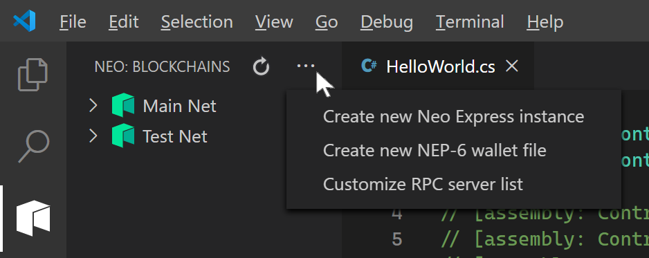
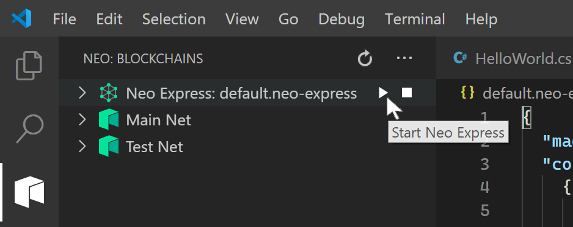
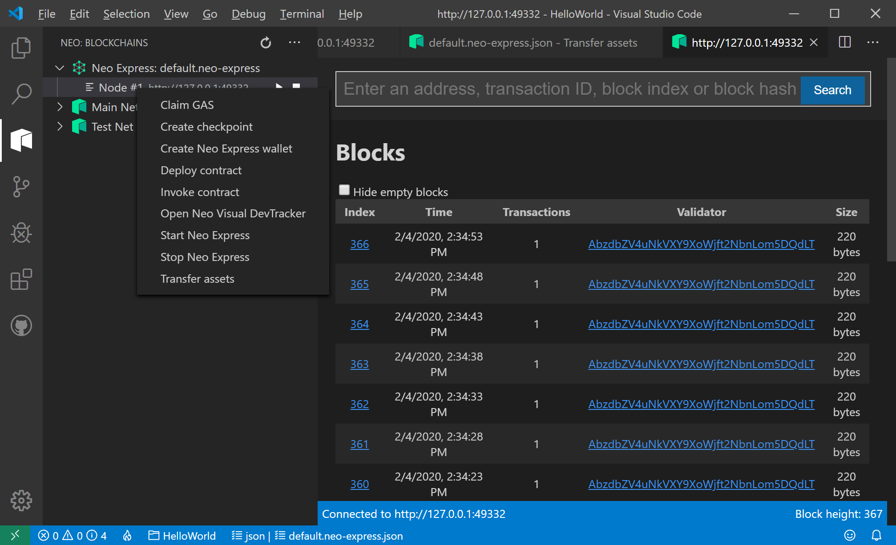
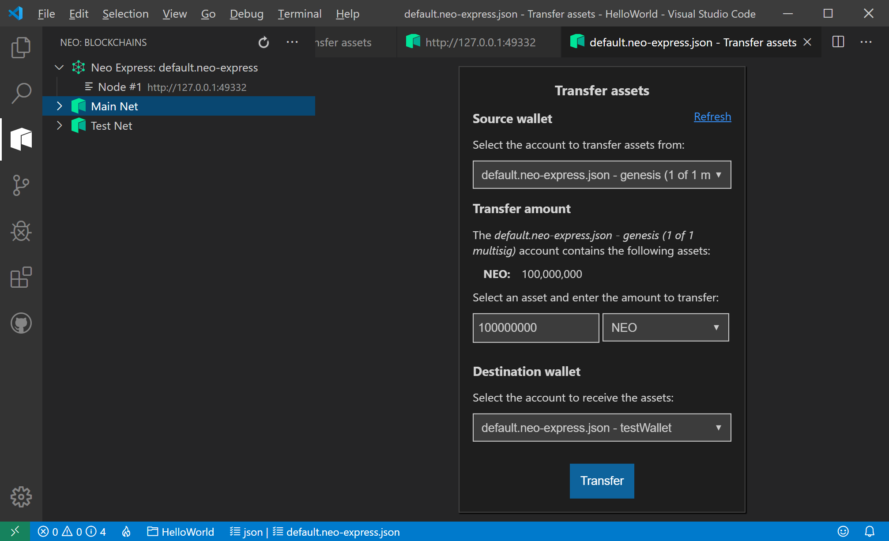
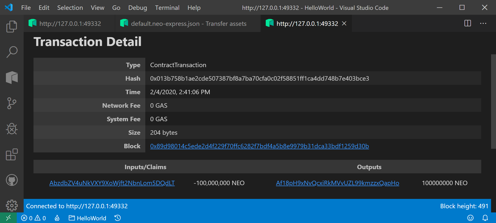
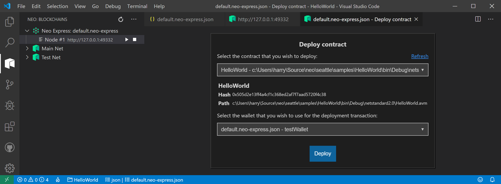
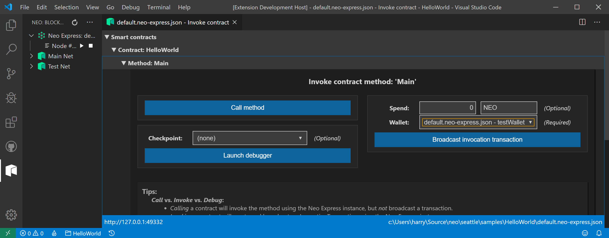

<!-- markdownlint-enable -->
# Neo Blockchain Toolkit for .NET Quickstart

## Prerequisites

* [.NET Core 3.1 SDK](https://dotnet.microsoft.com/download/dotnet-core/3.1)
* [Visual Studio Code (v1.40 or later)](https://code.visualstudio.com/Download)

> Note, .NET Core needs to be installed even if you don't plan to write smart
> contracts in a .NET language like C#.

### Ubuntu Prerequisites

Installing on Ubuntu 18.04 also requires installing libsnappy-dev and libc6-dev
via apt-get.

``` shell
$ sudo apt install libsnappy-dev libc6-dev -y
```

### MacOS Prerequisites

Installing on MacOS requires installing rocksdb via [Homebrew](https://brew.sh/).

``` shell
$ brew install rocksdb
```

## Installation

The [Neo Blockchain Toolkit](https://marketplace.visualstudio.com/items?itemName=ngd-seattle.neo-blockchain-toolkit)
is available from the [Visual Studio Code Marketplace](https://marketplace.visualstudio.com/vscode).
The official Visual Studio Code documentation has [information](https://code.visualstudio.com/docs/editor/extension-gallery)
about installing extensions. However, the most direct way to install the Neo Blockchain
Toolkit is by navigating to
[its official Marketplace page](https://marketplace.visualstudio.com/items?itemName=ngd-seattle.neo-blockchain-toolkit)
and clicking the green Install button.

THe Neo Blockchain Toolkit is an extension pack containing two extensions:
the [Neo Smart Contract Debugger](https://marketplace.visualstudio.com/items?itemName=ngd-seattle.neo-contract-debug)
and the [Neo Visual DevTracker](https://marketplace.visualstudio.com/items?itemName=ngd-seattle.neo-visual-devtracker).
While these extensions can be installed separately, it's usually easier to install
the Neo Blockchain Toolkit directly.

In addition to the Visual Studio Code extension, there are two
[.NET Core global tools](https://docs.microsoft.com/en-us/dotnet/core/tools/global-tools)
and a .NET template pack that need to be installed via the
[.NET command line interface](https://docs.microsoft.com/en-us/dotnet/core/tools/).

Open a terminal window and execute the following commands to install the additional
tools and template pack:

``` shell
$ dotnet tool install -g Neo.Express
$ dotnet tool install -g Neo.neon
$ dotnet new -i Neo.Contract.Templates
```

If this is the first time you've used
[.NET Core global tools](https://docs.microsoft.com/en-us/dotnet/core/tools/global-tools),
you will need to shutdown your terminal windows and reopen it. You may need to
log out completely and log back in again. Make sure the tools are correctly installed
and your path is correctly set up by running `neo-express --version` and `neon`.
The tools should echo back the version number. It will look similar to this:

``` shell
$ neo-express --version
1.0.7+391e234c56

$ neon
Neo.Compiler.MSIL console app v2.6.0.0
You need a parameter to specify the DLL or the file name of the project.
Examples:
  neon mySmartContract.dll
  neon mySmartContract.csproj
```

## Create a new Smart Contract

In your terminal window, create an empty directory called "HelloWorld".
Change to that directory and invoke the `dotnet new neo-contract` command.
This will create a simple Neo smart contract that writes Hello World to
blockchain storage.

``` shell
$ dotnet new neo-contract
The template "Neo Smart Contract" was created successfully.
```

## Build the Smart Contract

You can immediately build the smart contract via the `dotnet build` command.
The result should look something like this:

``` shell
$ dotnet build
Microsoft (R) Build Engine version 16.4.0+e901037fe for .NET Core
Copyright (C) Microsoft Corporation. All rights reserved.

  Restore completed in 182.74 ms for ~/HelloWorld/HelloWorld.csproj.
  HelloWorld -> ~/HelloWorld/HelloWorld/bin/Debug/netstandard2.0/HelloWorld.dll
  Neo.Compiler.MSIL console app v2.6.0.0
  Find entrypoint:System.Void HelloWorld::Main()
  convert succ
  gen abi succ
  gen debug succ
  write:HelloWorld.avm
  write:HelloWorld.abi.json
  write:HelloWorld.avmdbgnfo
  SUCC

Build succeeded.
    0 Warning(s)
    0 Error(s)

Time Elapsed 00:00:02.11
```

## Debug the Smart Contract

From the terminal window in your HelloWorld project directory, you can launch
Visual Studio Code by executing `code .`. This will launch an instance of Visual
Studio Code in the folder you created the smart contract in.

Before you can run the contract in the debugger, you need to create a launch
configuration. The Neo Contract Debugger makes this very easy.

* From the top-level Debug menu, select "Add Configuration"
* From the Select Environment input box, select "Neo Contract"

This will create a new launch.json file in the .vscode directory of your workspace.
The Neo Contract Debugger will automatically add a configuration to the launch.json
file for every .AVM file it locates in the workspace. Since we compiled the HelloWorld
contact in the last step, your launch.json file should look something like this

``` json
{
    // Use IntelliSense to learn about possible attributes.
    // Hover to view descriptions of existing attributes.
    // For more information, visit: https://go.microsoft.com/fwlink/?linkid=830387
    "version": "0.2.0",
    "configurations": [
        {
            "name": "HelloWorld.avm",
            "type": "neo-contract",
            "request": "launch",
            "program": "${workspaceFolder}/bin/Debug/netstandard2.0/HelloWorld.avm",
            "args": [],
            "storage": [],
            "runtime": {
                "witnesses": {
                    "check-result": true
                }
            }
        }
    ]
}
```

This launch configuration allows you to specify a variety of values to control
how your contract is executed. However, You don't need to change anything to run
the HelloWorld contract. Simply select Debug -> Start Debugging from the menu bar
or press "F5" to launch the HelloWorld contact for debugging. From here, the
following debug experiences work:

* You can Continue, Step Into, Step Over and Step In
* You can set breakpoints
* You can inspect the contents of emulated storage
* You can inspect the value of local parameters and variables.
* You can add local parameters and variables as well as emulated storage values
  to the watch window

> Note, the Hello World contract doesn't have any local parameters or variables.

## Create a Neo Express blockchain

> Note, In addition to this quickstart, there is also a
> [command reference document](https://github.com/neo-project/Neo Express/blob/master/docs/command-reference.md)
> for Neo Express.

Now that we have a smart contract, we need a blockchain to deploy it to. Neo Express
is a developer-focused Neo blockchain client. You can create new Neo Express blockchain
inside Visual Studio Code or from the command line.

> Note: Neo Express does not encrypt private keys. Please do not use wallets or
> accounts created by Neo Express on a production Neo blockchain.

By default, Neo Express creates a blockchain with a single consensus node. This
is often preferred for as the checkpoint features of Neo Express only work on a
single consensus node blockchain. However, you can create a blockchain with four
or seven consensus nodes if desired.

Neo Express stores all the information about the blockchain instance (including
unencrypted private keys) in a .neo-express.json file. If you inspect this file
after creating the Neo Express instance as described below, you'll see information
about the single consensus node for the blockchain we created, but the array of
wallets and contracts is empty.

### Create a Neo Express blockchain in Visual Studio Code

You can invoke the `Create new Neo Express Instance` command from Visual Studio Code's
[command palette](https://code.visualstudio.com/docs/getstarted/userinterface#_command-palette)
or from the Neo Blockchains view command drop-down.



Either approach will bring up the Create new Neo Express Instance panel where you
can specify the tile name and number of consensus nodes the new Neo Expres instance
will have. For this quickstart, stick with the defaults and press the Create Instance
button.

### Create a Neo Express blockchain from the command line

You create Neo Express blockchain on the command line via the `create` command.
By default, a single consensus node Neo Express blockchain is created, but you can
specify a four or seven consensus node blockchain via the `--count` argument.

``` shell
$ neo-express create
Created 1 node privatenet at ~/HelloWorld/default.Neo Express.json
    Note: The private keys for the accounts in this file are are *not* encrypted.
          Do not use these accounts on MainNet or in any other system where security is a concern.
```

## Run a Neo Express blockchain

Once we have created the Neo Express blockchain instance, a new node shows up in
the Neo Blockchain view. From here, we can start Neo Express via the play button
on the Neo Express node or the context menu of the node.



This creates a new Visual Studio Code terminal window showing the terminal output
of the running Neo Express node. A new block will be created every 15 seconds. This
is the default block generation period used on Neo MainNet and TestNet.

Neo Express allows the user to specify the block generation period. For development
purposes, it's often desirable to run the blockchain faster than the default. The
block generation period affects how quickly developers can view results of operations
like transfer and it affects how quickly accounts accumulate GAS.

Currently, only the default block generation period is supported when launching
Neo Express from inside Visual Studio Code. In order to quickly accumulate enough
GAS to deploy and run our smart contract, we are going to want to launch Neo Express
from the command line. Shut down the Neo Express instance running inside Visual
Studio Code via the stop button or by killing the terminal where it's running.
Then open a terminal window in your contract folder to execute the `run` command.

> Note, you can open a terminal window inside of Visual Studio Code if you wish.
> However, this quickstart will assume the reader is using a separate terminal window
> in order to avoid confusion over instructions like "Shut down the Neo Express instance
> running inside Visual Studio Code".

``` shell
$ neo-express run --seconds-per-block 1
09:49:37.99 ConsensusService Info OnStart
09:49:38.08 ConsensusService Info initialize: height=1 view=0 index=0 role=Primary
09:49:38.15 ConsensusService Info timeout: height=1 view=0
09:49:38.15 ConsensusService Info send prepare request: height=1 view=0
09:49:38.23 ConsensusService Info send commit
09:49:38.32 ConsensusService Info relay block: height=1 hash=0x096aaa25191b8601856a0a1744b7f19b06807fd9888e247366eec3d212a507b6 tx=1
09:49:41.32 ConsensusService Info persist block: height=1 hash=0x096aaa25191b8601856a0a1744b7f19b06807fd9888e247366eec3d212a507b6 tx=1
09:49:41.32 ConsensusService Info initialize: height=2 view=0 index=0 role=Primary
09:49:42.33 ConsensusService Info timeout: height=2 view=0
09:49:42.33 ConsensusService Info send prepare request: height=2 view=0
09:49:42.34 ConsensusService Info send commit
09:49:42.35 ConsensusService Info relay block: height=2 hash=0x195f354baa79d5cf4f476748fadc82b0fa0ed5e584ec9bd9762e8948a799dbd0 tx=1
09:49:42.35 ConsensusService Info persist block: height=2 hash=0x195f354baa79d5cf4f476748fadc82b0fa0ed5e584ec9bd9762e8948a799dbd0 tx=1
...
```

Since this is a single-node blockchain, you don't need to specify which node of
the blockchain to run. The --seconds-per-block option (-s for short) controls
the block generation period. The run command will start the blockchain and continue
logging information about new blocks to the terminal until you shut down the node
via Ctrl-C.  

## Examine the blockchain with Visual DevTracker

With the blockchain running in a terminal window, we can explore the Neo Express
instance using Neo Visual DevTracker. You open Visual DevTracker from a Neo Express
node context menu or by selecting a specific RPC Servers in the Neo Blockchain view.



You can immediately get a feel for the tracker by opening Neo Visual DevTracker
for either MainNet or TestNet. Those blockchains will have significantly more
interesting blocks in them than the HelloWorld blockchain does.

If you've ever used a NEO blockchain tracker like [NEOSCAN](https://neoscan.io/)
or [NEO Tracker](https://neotracker.io/) before, Visual DevTracker should feel
familiar. If you haven't, Visual DevTracker allows you to inspect individual blocks
and transactions in the blockchain. From the Blocks window, select
any block index to inspect that specific block. Within the Block window, you can
select any of the contained transactions by ID to get more information. There is
also a search window so you can directly inspect up any block, transaction or
wallet address as well as a list of recently viewed items so you can go back to
items you have inspected previously.

When running Neo Express faster than default, it's often the case that many of the
blocks will only contain a Miner transaction. These blocks clutter the chain and
make it hard to locate the blocks that contain interesting transactions. When using
Neo Visual DevTracker with a Neo Express instance, there is a "Hide empty blocks"
checkbox in the upper left hand corner of the Blocks window. This will automatically
filter out all of the blocks that only contain a Miner transaction, making it easier
to locate blocks of interest. If you select that checkbox now, all but the initial
block (also known as the "genesis" block) will be filtered out.

> Note the "Hide empty blocks" feature is only available for Neo Express blockchains.

As you make transfer NEO, claim GAS and deploy contracts over the course of this
quickstart, you can return to the Visual DevTracker to inspect the blocks associated
with these operations.

## Create a Neo Express Wallet

Neo Express allows you to refer to wallet account by an easy-to-remember names
instead of by Base58 encoded addresses like `AZDRabBcW4eESVfh9ssLd6udza9xpPn1P6`.
There are a few reserved names, such as 'genesis'. Genesis refers to the multi-
signature account that receives the genesis Neo created for every new blockchain.

You can create a new Neo Express wallet inside Visual Studio Code by selecting
"Create Neo Express Wallet" from the Neo Express context menu. Visual Studio Code
will prompt you to enter a wallet name and then add the wallet information to
the .neo-express.json file. You can enter whatever wallet name you wish except
for reserved names such as 'genesis' or 'node1', but the rest of this quickstart
will use the name "testWallet".

Alternatively, you can create a wallet from the command line via the `wallet create`
command.

``` shell
$ neo-express wallet create testWallet
testWallet
        AZDRabBcW4eESVfh9ssLd6udza9xpPn1P6
    Note: The private keys for the accounts in this wallet are *not* encrypted.
          Do not use these accounts on MainNet or in any other system where security is a concern.
```

## Transfer Assets in the Neo Express blockchain

When a Neo blockchain is created, 100,000,000 NEO tokens are created and transferred
to a special account associated with the consensus node accounts. These tokens can
be transferred to a standard account in order to more closely mirror the developer
experience of working with MainNet or TestNet.

You can bring up the Transfer Assets panel via the Neo Express context menu. From
this panel, you simply select the source and destination wallets plus the amount
of NEO or GAS to transfer. Go ahead and transfer all 100,000,000 NEO to testWallet.



Performing the transfer will bring up a dialog with a link to the transaction
containing the transfer. It will take at least two seconds to confirm the transaction,
so clicking the link immediately will likely take a small delay before the Transaction
Detail page appears.



From this page, we can inspect the block containing the transfer transaction or
details for the source or destination accounts.

> Note, you can transfer NEO tokens on the command line via the `transfer` command.

## Claim GAS in the Neo Express blockchain

Neo blockchains have two native tokens: NEO and GAS. NEO tokens are known as the
governance token and are used in a variety of network management scenarios. GAS
tokens are the utility token and are used to pay for certain actions on the blockchain
network such as deploying or invoking a smart contract. While 100,000,000 NEO tokens
are created on blockchain creation, GAS tokens are created on every block and distributed
to NEO holders.

> For more details on Neo's economic model, please see the
> [Neo Whitepaper](https://docs.neo.org/docs/en-us/basic/whitepaper.html#economic-model).

Because the Neo Express blockchain is creating a new block every second, GAS will
build up pretty quickly. The genesis wallet will have GAS for every block that was
minted before you transferred the genesis NEO to the testWallet account. The testWallet
account will have GAS for every block that has been minted since the transfer.

When GAS is distributed to a NEO holder, it starts in the "unavailable" state. Before
GAS can be claimed, the NEO holder must execute a NEO transfer. In order to release
unavailable GAS, it is common for a NEO transfer to be executed from and to a specific
account. Even though NEO doesn't change hands, transferring NEO to yourself is all
that it takes to make your GAS available.

From the asset transfer transaction detail panel we looked at earlier, we can navigate
to the genesis and testWallet account detail pages. The genesis account detail panel
should have a non-zero value for available GAS. The testWallet account detail panel
should have a non-zero value for unavailable GAS.

Claiming GAS is easy - simply select Claim GAS from the Neo Express context menu,
select the desired account and press Claim. Like the Transfer Asset workflow, a
panel with a link to the claim transaction will be shown.

Once claimed, GAS acts similar to NEO. Once you claim the genesis account GAS, you
can transfer it to the testWallet account using the same basic steps from the Transfer
Assets workflow described above. You can unlock testWallet GAS by following the Transfer
Assets workflow to transfer all of the testWallet NEO to itself. In order to experiment
with deploying and invoking smart contracts, you'll need around 1000 GAS.

> Note, you can see how much GAS is available for a given account on the command
> line with the `show gas` command. You an claim GAS on the command line with the
> `claim gas` command.

## Deploy a Smart Contract to Neo Express blockchain

Now that we have a running Neo Express blockchain and a standard wallet account
with plenty of GAS, we can deploy our smart contract to the blockchain. Select
Deploy Contract from the Neo Express context menu to bring up the Deploy Contract
panel. Select the contract you wish to deploy (from all the compiled smart contracts
in the workspace) and the account from which to pay the deployment GAS price and
press Deploy. Again, you will be given the option to navigate to deployment
transaction in Neo Visual DevTracker.



> Note, you can deploy a smart contract via the command line via the `contract
> deploy` command

Note, there are several features that Neo smart contract must declare their use
of: storage, payable and dynamic invoke. These can be specified in a C# smart contact
via the Features assembly attribute. The HelloWorld template contract writes to
contract storage, so it declares that it needs storage via the attribute.

``` csharp
// [assembly: ContractTitle("optional contract title")]
// [assembly: ContractDescription("optional contract description")]
// [assembly: ContractVersion("optional contract version")]
// [assembly: ContractAuthor("optional contract author")]
// [assembly: ContractEmail("optional contract email")]
[assembly: Features(ContractPropertyState.HasStorage)]

public class HelloWorld : SmartContract
{
    public static void Main()
    {
        Storage.Put(Storage.CurrentContext, "Hello", "World");
    }
}
```

There are several other assembly attributes that can be used to specify metadata
about the contract. These additional metadata attributes are optional. Neo Blockchain
Toolkit will use reasonable defaults for these attributes if they are not specified.

You can get information about deployed contracts on the command line via the
`contract get` command.

> Note, inspecting deployed contracts from inside Visual Studio Code will be
> coming in a future release of Neo Visual DevTracker.

``` shell
$ neo-express contract get ./bin/Debug/netstandard2.0/HelloWorld.avm
{
  "version": 0,
  "hash": "0x505d2e13ff4a4cf1c368ed2af7f7aad5720f4c38",
  "script": "00c56b616168048418d60d0548656c6c6f05576f726c64615272680452a141f561616c7566",
  "parameters": [],
  "returntype": "Void",
  "name": "HelloWorld",
  "code_version": "1.0.0.0",
  "author": "",
  "email": "",
  "description": "",
  "properties": {
    "storage": true,
    "dynamic_invoke": false
  }
}
```

## Invoke a Smart Contract on the Neo Express blockchain

Now that we've deployed the contract to our Neo Express blockchain, we can now invoke
it. Select Invoke Contract from the Neo Express context menu to bring up the Invoke
Contract panel.

> Note, you can invoke a contract from the command line via the `contract invoke`
> command. However, the command line contract invocation capabilities are severely
> limited due to the command line interface. A future version of Neo Blockchain Toolkit
> will address this limitation.

 Neo Visual DevTracker will search the workspace for all contracts as well as all
 operations on those contracts. Our workspace has only a single contract with a
 single operation, so expand the Smart Contracts, Contract: HelloWorld and Method:
 Main nodes to bring up the invocation UI for main entry point of our HelloWorld
 contract.



> Note, the Hello World contract has no parameters. If it did, the Invoke Contract
> panel would have additional input fields for specifying the parameter values.

This UI is complex as it support multiple launch mechanisms. The differences are
detailed at the bottom of the Launch Contract panel. For the quickstart, we are
going to use the "Broadcast invocation transaction". This is the only option that
will update the blockchain with the results of the contract invocation. In order
to invoke the contract, we need to provide a wallet that will pay the GAS cost
of the contract invocation. Select testWallet from the dropdown and press the
"Broadcast invocation transaction" button. Like we've seen earlier, we will be
presented with a link to the invocation transaction detail page. At the bottom of
the transaction detail page, we can see the application log for the invocation
in JSON format.

``` json
[
    {
        "contract": "0x750a640a519d64ddc89740a80841c357bf1981c7",
        "gas_consumed": "1.017",
        "notifications": [],
        "stack": [],
        "trigger": "Application",
        "vmstate": "HALT"
    }
]
```

> Note, the Hello World contract has no return value. If it did, we would see
> it in the stack property.

The HelloWorld contract takes no parameter and it returns no values. However,
it does modify contract storage in the blockchain. You can dump the storage
state for a given contract from the command line with the Neo Express `contract
storage` command. This command lists all the key/value pairs for a given contract
in the blockchain, showing both keys and values as both a hex-encoded byte array
as well as a UTF-8 encoded string.

``` shell
$ neo-express contract storage ./bin/Debug/netstandard2.0/HelloWorld.avm
0x48656c6c6f
  key (as string)   : Hello
  value (as bytes)  : 0x576f726c64
        (as string) : World
  constant value    : False
```

> Note, inspecting contract storage from inside Visual Studio Code will be
> coming in a future release of Neo Visual DevTracker.

## Other Neo Blockchain Toolkit Samples

Now that you've built and run the HelloWorld quickstart, here are some other Neo
Blockchain Toolkit samples you can try out.

* [Domain](https://github.com/ngdseattle/domain-sample)
* [CNEO](https://github.com/ngdseattle/cneo-sample)
* [Escrow](https://github.com/ngdseattle/escrow-sample)
